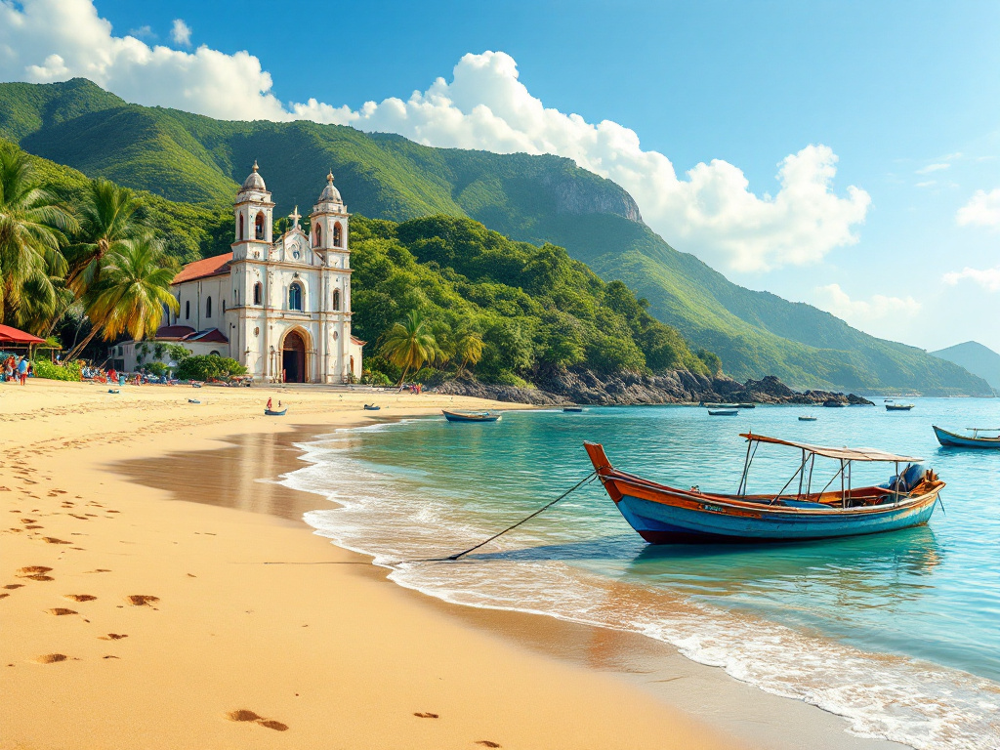

# Lokal Guide – Your Digital Travel Guide

Travel **smarter and safer**! Let our guide be your **local companion** on your adventures.

Access all your **essential information**:

- ✅ Emergency Contacts 🚔🏥
- ✅ Nearby ATMs 🏧
- ✅ Pasalubong Centers 🛍️
- ✅ Transportation Options 🚗

---

  

      
      

          
<strong>Daraga</strong> Known for its stunning views of the iconic Mayon Volcano

      

  

  

      
      

          
<strong>Paracale</strong> With its lovely coastal landscapes

      

  


